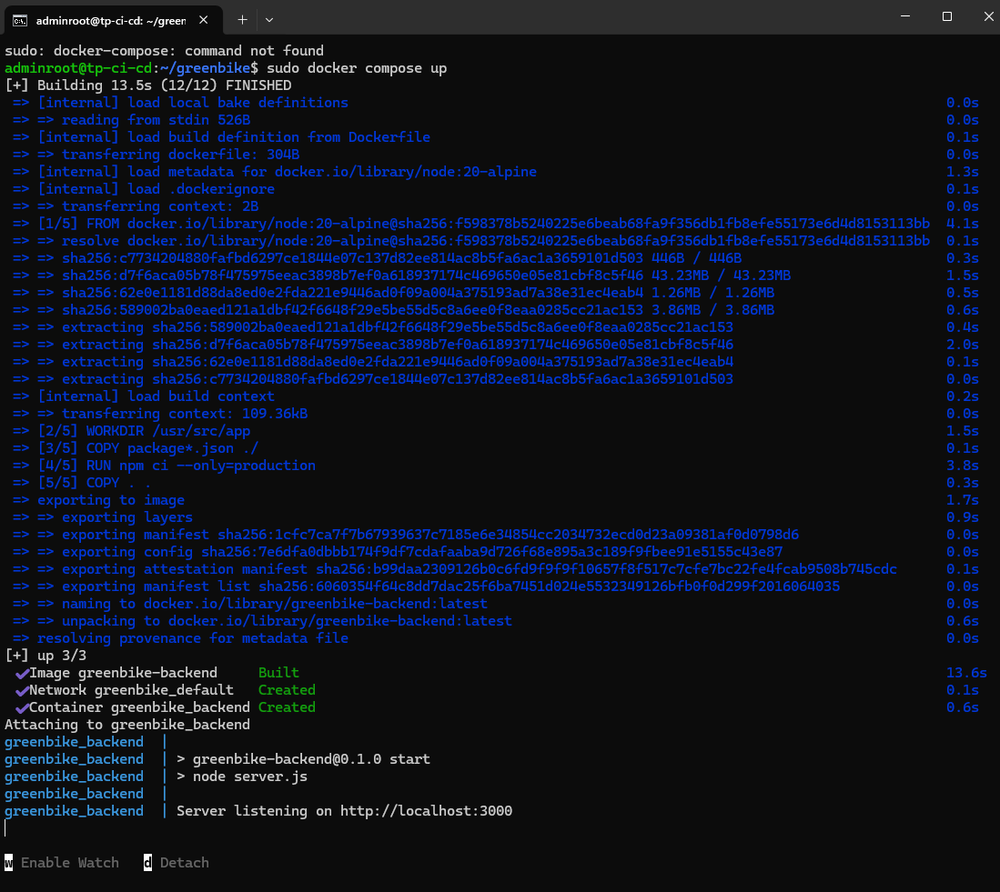
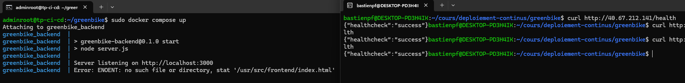
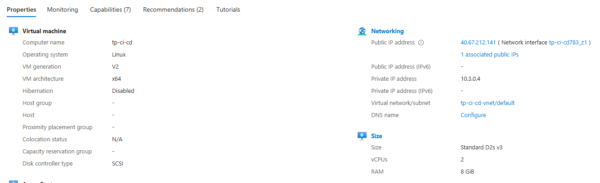

## Information générales
Par simplicité, j'ai seulement effectué des tests sur mon backend, et c'est ce backend que j'ai fait tourner sur ma VM azure.

## VM Azure

La docker image de mon backend qui tourne sur la vm Azure :

Mon server qui tourne, et auquel j'accède depuis ma console WSL locale :

La VM publique avec ses statistiques et son IP publique

## Pipeline

- **le fonctionnement du pipeline:**
  La Pipeline est simple : elle effectue les tests jest du dossier "test" (avec npm test) après avoir checkout, installé NodeJS et installé les dépendances

- **comment le déploiement est déclenché:**
  Le déploiement des github actions s'effectue à chaque pull et push

- **les choix techniques réalisés:**
  J'ai réutilisé un projet antérieur avec nodejs. Le choix de Jest pour les tests vient de mes préférences personnelles, car j'ai déjà eu l'occasion de travailler avec ce framwork, en plus du fait qu'il soit très utilisé et qu'il ait une bonne documentation.
  